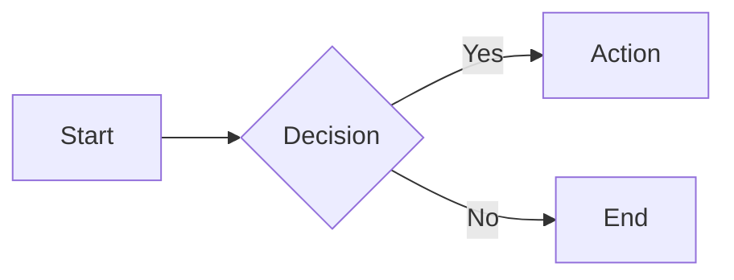

# mdserve

Instant MkDocs server for any directory. No configuration required.

## Features

- **Zero config**: Just run `mdserve` in any directory with Markdown files
- **Auto port selection**: Starts on port 3000, auto-increments if busy
- **Directory structure**: Navigation preserves your folder hierarchy
- **Filename as title**: Uses filenames for navigation (not H1 headings)
- **Live reload**: Auto-refreshes on file changes (add/edit/delete)
- **Mermaid support**: Render diagrams with fenced code blocks
- **Dark mode**: Material theme with light/dark toggle

## Installation

### Using Nix (recommended)

```bash
# Run directly without installation
nix run github:USERNAME/mdserve

# Or install to profile
nix profile install github:USERNAME/mdserve
```

### Using Nix Flakes in your config

Add to your `flake.nix`:

```nix
{
  inputs.mdserve.url = "github:USERNAME/mdserve";

  outputs = { self, nixpkgs, mdserve, ... }: {
    # Add to your packages
    home.packages = [ mdserve.packages.${system}.default ];
  };
}
```

## Usage

```bash
# Serve current directory
mdserve

# Serve specific directory
mdserve ./docs

# Use specific port
mdserve -p 8080

# Combine options
mdserve -p 3001 ./my-docs
```

## Example

```bash
$ mdserve ~/my-project
Syncing documentation files...
Serving documentation from: /home/user/my-project
URL: http://localhost:3000
```

Then open http://localhost:3000 in your browser.

## Mermaid Diagrams

Use fenced code blocks with `mermaid` language:

~~~markdown

~~~

## How It Works

1. Scans directory for `*.md` files recursively
2. Copies to temp directory with front matter (title = filename)
3. Generates MkDocs config with Material theme
4. Starts MkDocs dev server with live reload
5. Watches for file changes and re-syncs

## Excluded Directories

The following directories are automatically excluded:

- `build/`, `out/`, `target/`
- `.git/`, `.repo/`
- `node_modules/`, `__pycache__/`
- `.venv/`, `venv/`
- `tmp/`, `cache/`

## Requirements

Handled automatically by Nix:

- Python 3
- MkDocs
- MkDocs Material theme
- MkDocs Mermaid2 plugin
- inotify-tools (Linux, for efficient file watching)

## License

MIT
